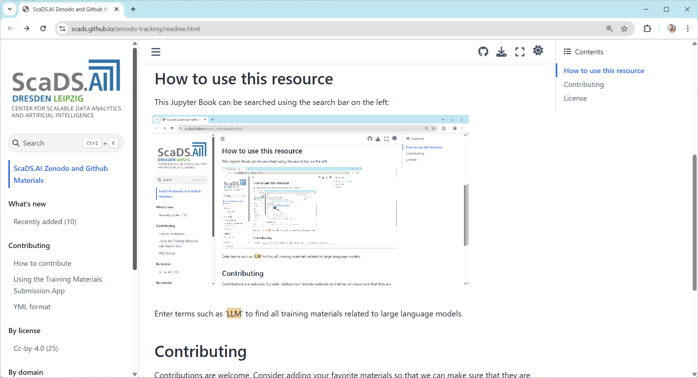

# ScaDS.AI Zenodo and Github Materials

This Jupyter Book contains {number_of_links} links to materials by members of ScaDS.AI published on Zenodo or Github. Last updated: {last_updated}.

This is a **preliminary** / **experimental** search index allowing us to explore how such a database could look like. We follow the principle [_release early, release often_](https://en.wikipedia.org/wiki/Release_early,_release_often) and aim at having a functional prototype of the index at any time. We will use this resource to 
* explore what kind of meta-data we need to collect for our materials
* how we can automatically collect links to materials
* how we could potentially inject our list of materials into the other indices
* how to collect links to materials following the FAIR principles (findable, accessible, interoperable, reusable)

Feedback and contributions are very welcome, e.g. as [github issue](https://github.com/scads/zenodo-tracking/issues).

## How to use this resource

This Jupyter Book can be searched using the search bar on the left:

Enter terms such as 'LLM' to find all training materials related to large language models.

## Contributing

Contributions are welcome. Consider adding your favorite materials so that we can make sure that they are findable and reusable. The easiest way to do this is by uploading your materials to zenodo.org and submitting it to the [ScaDS.AI community](https://zenodo.org/communities/scads-ai/). More instructions to contribute you find on the contributing page.

## License

All contents of this Jupyter book and the corresponding Github repository are licensed [CC-BY 4.0](https://creativecommons.org/licenses/by/4.0/), unless mentioned otherwise.

